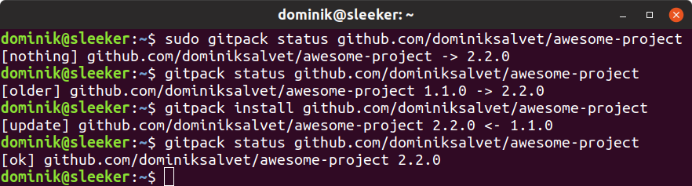

GitPack is going to go through [significant changes](https://github.com/dominiksalvet/gitpack/projects/1) in the future. **My [GitPack projects](https://github.com/topics/gitpack) are and will be compatible.**

---

# GitPack

<p align="center">
    
</p>

<p align="center">
    <a href="https://github.com/dominiksalvet/gitpack/commits">
        </a>
    <a href="https://github.com/dominiksalvet/gitpack">
        </a>
    <a href="https://github.com/RichardLitt/standard-readme">
        </a>
</p>

> Simple Git-based package manager.

Wouldn't it be great to **install and update** your favorite Git projects like this?

```
gitpack install <url>
```

And when they are no longer needed, **uninstall** them that way?

```
gitpack uninstall <url>
```

If you are in, then GitPack comes in pretty handy. All you need is a URL of a compatible Git project.

---

**Are you a developer?** Do you like the idea stated above? Then keep reading in the [Developer](#developer) section.

> Do you want to support this awesome project? **Then spread the word!**

## Table of Contents

* [Install](#install)
  * [Dependencies](#dependencies)
* [Usage](#usage)
  * [Example](#example)
* [Developer](#developer)
  * [Badge](#badge)
* [Contributing](#contributing)
* [License](#license)

## Install

**Global** (system) installation:

```sh
mkdir -p /tmp/gitpack/ && cd /tmp/gitpack/ && # prepare a temporary directory
git clone https://github.com/dominiksalvet/gitpack.git ./ && # clone repository
git checkout "$(git describe --tags --abbrev=0)" && # use latest version
sudo src/gitpack install github.com/dominiksalvet/gitpack # install GitPack
```

**Local** (user) installation:

```sh
mkdir -p /tmp/gitpack/ && cd /tmp/gitpack/ && # prepare a temporary directory
git clone https://github.com/dominiksalvet/gitpack.git ./ && # clone repository
git checkout "$(git describe --tags --abbrev=0)" && # use latest version
src/gitpack install github.com/dominiksalvet/gitpack # install GitPack
```

### Dependencies

* **Git** software

## Usage

**Install or update** a Git project:

```
gitpack install <url>
```

**Uninstall** a Git project:

```
gitpack uninstall <url>
```

Show **status** of a Git project:

```
gitpack status <url>
```

> Your favorite project is not compatible? Then encourage its developers to take a look at the [Developer](#developer) section below.

### Example

<p align="center">
    
</p>

As demonstrated, GitPack works with either global or local installations based on whether it is run with root permissions.

## Developer

Why should you use GitPack in your projects?

* Simple by design
* Language-independent
* Runs on Linux, macOS and Windows (WSL)
* Shell environment and Git is all you need
* Global and local installations
* Delta updates
* POSIX-friendly

How? The [*guide.md*](guide.md) file will show you the way. Then users can **immediately use GitPack to install your projects**.

Not sure? Take a look at [*.gitpack*](.gitpack) directory of GitPack itself. It can be that simple.

### Badge

GitPack projects work best with the following sleek badge:

[](https://github.com/dominiksalvet/gitpack)

Markdown:

```markdown
[](https://github.com/dominiksalvet/gitpack)
```

## Contributing

Do you want to contribute? Do you have any questions? Then the [*contributing.md*](contributing.md) file is here for you.

## License

GitPack is licensed under the [MIT License](license).
